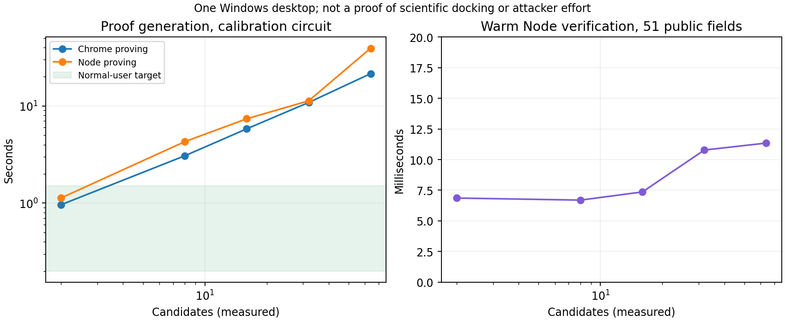

# Bounded scientific search, succinct proofs and enforceable difficulty

Investigation and measurements completed 7 September 2026. This report supersedes the next-step recommendation in the earlier [docking feasibility report](DOCKING_GROTH16_FEASIBILITY_2026-09-07.md). [Evidence, source code and reproduction](../evaluation/docking_ladder_2026-09-07/README.md) accompany the findings. Measurements, analytical results and unimplemented designs are distinguished below.

## Recommendation

**Docking is salvageable as a scientifically grounded bounded-search workload, but it is not yet a defensible source of enforced attacker effort. Prefer a certified discrete-search architecture for the next paper experiment, with protein-design energy optimization as the leading biological workload and rigid docking as a comparison. Do not use raw random trajectory audits as the security foundation.**

There is a concrete improvement: a new Groth16 prototype proves exact bounded search over a restricted **published protein-design energy model**, with Chrome proving medians of **0.625 s for 16 candidates and 1.422 s for 64**. The original contact calibration needs **5.819 s and 21.511 s**, respectively. This makes the discrete representation worth pursuing. However, the same protein-design search takes only **0.172 ms and 0.459 ms** in an ordinary BigInt implementation; server proof verification takes **7.71 ms and 7.39 ms**. We have improved proof feasibility, not demonstrated useful-computation savings.

Three facts must stay separate:

| Question | What can establish it? | What has been established here? |
|---|---|---|
| Is the returned scientific result valid/useful? | Correct objective, valid molecular inputs, independent numerical checks, and a scientific use case/evaluation | Real-grid agreement and exact published energy-model evaluation; no new binder/design or prospective screening benefit |
| Is the result correct for the entire assigned bounded computation? | A sound proof of the complete relation, including data binding, candidate generation and reduction | Actual Groth16 proofs for the calibration and restricted protein-design relations; no full grid-search proof |
| Did this client incur the requested amount of **fresh** computation? | A precisely stated hardness/amortization assumption plus an adversarial protocol and empirical attack evaluation | **Not established.** Correct relation evaluation does not imply a physical CPU-time lower bound |

The second row is necessary for the user's security question, but does not fully answer the third. An attacker may exploit precomputation, a better algorithm, shared results, faster hardware or a different prover. A proof demonstrates a mathematical statement, not a record of physical instructions executed on a particular browser.

## 1. A meaningful bounded docking assignment

Define a campaign with a receptor, atom typing, protonation/conformer policy, pocket box, potential model and version, quantization rules, a finite pose/conformer bank, and a commitment to the prepared data. An assignment specifies a bank interval or bijective permutation, starting index, candidate count N, deterministic tie-breaking, and any exact local-refinement step count. The required answer is the best score and first winning index over **all assigned candidates**. If all are forbidden, return an explicit no-feasible-candidate result. An incumbent/result therefore always exists as a protocol output, although it may not improve the scientific campaign.

The proof must constrain candidate generation, valid transformations, every score and the minimum/top-k reduction. Proving only the winner's score reintroduces the original shortcut. For a trajectory algorithm, constrain the initial state, pseudorandom choices, every transition, restart schedule and final reduction. Do not interpret a heuristic `exhaustiveness` parameter as an exact instruction budget.

Grid-based scoring is established docking methodology. DOCK supports rigid and flexible search and precomputed receptor potentials evaluated by interpolation; this is a legitimate place to move receptor-dependent preparation outside a circuit. It does not justify arbitrarily replacing the potential with an easy polynomial. [DOCK manual](https://dock.compbio.ucsf.edu/DOCK_6/dock6_manual.htm)

### Implemented real-grid pilot

The new `rigid_grid_search.py` uses **actual Vina affinity maps** generated by the pinned Vina 1.2.7 source from the previous pilot. It enumerates 24 proper cubic rotations × 8³ translations = **12,288 poses** for each fixed ligand conformer. The ligand centroid is placed at the assigned pocket center. A stride-5 permutation gives unique bank IDs; symmetry-equivalent molecular poses can still exist. Positions round to 0.001 Å. The integer objective uses grid values scaled by 10,000, 10-bit interpolation fractions, and a defined integer version of Vina's positive-energy softening. Every arithmetic/range rule must become part of a future circuit.

The independent native oracle reloads the **serialized** maps before scoring. Consequently it checks the same exchanged potential values and grid coordinates, not higher-precision pre-export values. We compare Vina's ligand–grid energy component, not total binding affinity. Internal conformation is fixed; this is coarse pose screening, not full flexible Vina.

| Case | Poses evaluated | Native oracle checks | Largest float/oracle difference | Largest integer/float difference | Top-1 / top-10 agreement |
|---|---:|---:|---:|---:|---|
| 2P16, apixaban/factor Xa | 12,288 | 25 | 2.84×10⁻¹³ | 0.0141 | Yes / 10 of 10 |
| 4LL3, darunavir/HIV protease | 12,288 | 25 | 1.71×10⁻¹³ | 0.0129 | Yes / 10 of 10 |
| 4TZ4, lenalidomide/cereblon | 12,288 | 25 | 1.57×10⁻¹³ | 0.0087 | Yes / 10 of 10 |

The complete Python bank searches take **185.7, 412.4 and 150.7 ms**, versus **0.789, 1.551 and 0.517 ms** for checking one pose under the integer objective. These are local, prepared-input measurements, with six search samples per point. Grid preparation/export/reload costs about 1.8–2.1 seconds for the first two cases; map files are roughly 4.9–7.1 MiB per case. Preparation, loading, networking and cryptographic proving are excluded from those search/check ratios.

**Scientific limitation:** all three best coarse-bank grid energies are positive (13.719, 65.342, 4.903). This sparse orientation bank and initial conformer do not establish good docking poses. Ranking agreement here validates numerical implementation, not enrichment or binding prediction. A serious screening workload needs richer conformers/orientations, comparison with flexible docking, pose-recovery and active/decoy benchmarks, and independent scientific review. These public examples do not represent unexplored biology.

## 2. What to prove, and what preprocessing can stay outside

Keep receptor preparation, potential-grid construction, ligand atom typing, conformer-library generation and model selection outside the circuit **as trusted, versioned scientific inputs**. Prove the expensive repeated search and its output. For untrusted preparation, separately verify/certify it; a search proof cannot certify scientific inputs it simply assumes.

Prepared data must enter through fixed circuit constants, public inputs, or authenticated accesses to a public commitment. A private witness containing arbitrary grid scores is unsound. The contract must bind grid index, atom type, interpolation corners and value, not merely a root that the server never compares with its campaign. Conversely, precomputing every candidate's final score on the server has already performed the delegated search and cannot be counted as a free preparatory step.

### The grid lookup bottleneck is measurable

I compiled a Circom probe for one Poseidon-authenticated table access at depth 20: **5,132 constraints**, including leaf index/value binding and range checks. With independent paths for all eight interpolation corners, paths alone would cost approximately **0.78 million constraints per 19-atom pose**, **1.40 million per 34-atom pose**, or **1.56 million per 38-atom pose**. Those full-pose counts are **projections**, not compiled molecular circuits. They omit transformations, interpolation and reduction; multiproofs, shared accesses, lookup arguments and smaller campaign-specific tables could change them substantially.

That explains why keeping Vina's preprocessing outside does not immediately yield a cheap Groth16 docking prover. Authenticating repeated dynamic table reads can dominate the arithmetic.

| Proof approach | Benefit | Remaining cost / status here |
|---|---|---|
| Groth16 with fixed campaign coefficients | Small proof; verification independent of circuit size when public-input count is fixed | Implemented. Circuit-specific setup and key distribution; changing campaign constants requires new keys |
| Universal lookup-oriented proof system | Can amortize membership checks against a table rather than use separate hash paths | Literature/design only; table size, commitment generation and prover memory still matter |
| Nova-family incremental/folding proof | Can accumulate repeated steps without one giant unrolled circuit | Not benchmarked here; step circuit, final compression, browser implementation and security assumptions must be evaluated |
| STARK/zkVM | Handles program execution more naturally; transparent designs avoid a circuit-specific ceremony | Not benchmarked here; larger execution traces/proofs and optional compression overhead |

Groth16 verification includes work linear in the number of public inputs, not universal O(1) for arbitrary statements. MicroNova describes verification independent of the number of repeated steps, with costs dependent on the step circuit and final compression. Neither removes proving cost. [Groth16 paper](https://discovery.ucl.ac.uk/id/eprint/1501201/1/Groth_SNARK9.pdf), [plookup](https://eprint.iacr.org/2020/315), [Nova implementation](https://github.com/microsoft/Nova), [MicroNova](https://www.microsoft.com/en-us/research/publication/micronova-folding-based-arguments-with-efficient-on-chain-verification/), [RISC Zero protocol](https://dev.risczero.com/proof-system-in-detail.pdf)

## 3. Measured scaling of the original Groth16 prototype

The original 8-ligand-atom/8-receptor-atom integer contact potential remains a **synthetic calibration**. These timings do not prove scientifically valid docking. Circom 2.2.3 `--O2`, snarkjs 0.7.6, single-thread proving, Ryzen 7 7435HS, Windows, Node 24.4.0 and Chrome 152.0.7977.76. Three fresh Node processes and two fresh Chrome processes per measured tier. Browser proving includes loopback key/WASM fetching, excludes library loading. Production network/queueing is absent.

| N | Constraints, measured | Chrome proof median | Node proof median | Warm server verify median | Node peak RSS max | Chrome + asset-server peak RSS max | Key size |
|---:|---:|---:|---:|---:|---:|---:|---:|
| 2 | 13,302 | 0.962 s | 1.130 s | 6.86 ms | 346 MiB | 862 MiB | 7.78 MiB |
| 8 | 51,486 | 3.073 s | 4.296 s | 6.69 ms | 322 MiB | 995 MiB | 30.23 MiB |
| 16 | 102,398 | 5.819 s | 7.383 s | 7.36 ms | 441 MiB | 1,731 MiB | 60.16 MiB |
| 32 | 204,222 | 10.862 s | 11.301 s | 10.78 ms | 578 MiB | 2,456 MiB | 120.03 MiB |
| 64 | 407,870 | 21.511 s | 39.283 s | 11.35 ms | 922 MiB | 2,926 MiB | 239.77 MiB |

External memory sampling runs every 50 ms over the entire process lifetime. Browser values sum Chrome and the Node asset server and may count shared pages more than once. They are **not pure WASM allocations**. Fixed runtime costs explain some nonmonotonicity. The Node 32-candidate proving range is 11.11–19.36 s; these few trials are not confidence intervals. Cold Node verification is about **196–408 ms**, substantially above warm verification. Different runtimes and timing paths prevent interpreting Chrome/Node ratios as universal speedups.

The exact compiled constraint growth is **C(N)=6,364N+574**. There are always 51 public field elements; proof JSON size remains 720–726 bytes, excluding statement/key/envelope. All 25 published proofs verify independently; 75 altered statements and one wrong-tier use fail.

### 128 and 256: compiled, not proved

| N | Constraints **measured** | R1CS bytes **measured** | Chrome proof **projected** | Node proof **projected** | Key **projected** |
|---:|---:|---:|---:|---:|---:|
| 128 | 815,166 | 180,136,780 | 42.8–54.9 s | 44.4–86.0 s | 479 MiB |
| 256 | 1,629,758 | 360,162,124 | 85.6–115.3 s | 88.7–180.8 s | 958 MiB |

Compilation itself took 30.0/61.6 s and peaked at about 671/1,264 MiB sampled RSS. No 128/256 proving keys, successful proofs or verifier timing samples were generated. We stopped proof execution at 64 after measuring substantial browser memory/key cost; this is not a claim that larger proofs cannot run.

Time envelopes interpolate between linear-C and C log C scaling, calibrated on individual measured 16/32/64 trials. Key sizes use their measured affine growth. Crude linear RSS/C projections give Node **1.74–3.43 GiB / 3.47–6.86 GiB**, and the combined browser tree **5.65–13.45 GiB / 11.30–26.90 GiB**, at 128/256. These wide memory ranges are **not capacity guarantees**: fixed costs, garbage collection, buffer duplication, paging and allocation limits make extrapolation unreliable. Verification is expected to remain in the same order for a fixed public statement, but no 128/256 time has been measured.

## 4. Scientifically defensible alternatives

| Workload | Scientific use / representation | Proof implications |
|---|---|---|
| Rigid-pose search with Vina/DOCK-style grids | Coarse placement, pose filtering, candidate generation before flexible rescoring | Reusable receptor preparation; lookup authentication is expensive; implemented numerical pilot above |
| PLP/ChemPLP | Established docking potentials with piecewise-linear interaction terms | More attractive than full transcendental scoring, but distances, angles and H-bond terms remain; replacing distance with squared distance changes the model |
| rDock grid scoring | Established grid potentials plus other chemistry-dependent terms | Must retain/validate omitted polar, internal and desolvation terms; no local circuit benchmark |
| FFT protein–protein docking | Exhaustive translations under grid correlation for fixed rotations | Legitimate different biological task; compare against optimized FFT, not naive cubic arithmetic; no local proof benchmark |
| Discrete protein-design energy search | Unary and pairwise conformation costs with finite rotamer/state domains | Exact integer/binary objectives are substantially easier to constrain; implemented below |

ChemPLP's real model includes hydrogen bonding and multiple linear potentials; its name is not permission to substitute arbitrary easy arithmetic. PIPER uses FFT-based protein docking, which addresses a different molecular-search regime. [CCDC scoring documentation](https://support.ccdc.cam.ac.uk/support/solutions/articles/103000306391-what-is-the-difference-between-the-goldscore-chemscore-asp-and-chemplp-scoring-functions-provided-w), [rDock scoring](https://rdock.github.io/documentation/html_docs/reference-guide/scoring-functions.html), [PIPER paper](https://arxiv.org/abs/q-bio/0605018)

### Implemented exact protein-design proof

OSPREY uses prepared one-body and pairwise energy matrices to support conformational search. This gives a natural scientific separation between energy preparation and combinatorial optimization. Guarantees remain relative to the input model. [OSPREY architecture](https://donaldlab.cs.duke.edu/software/osprey/docs/contributing/architecture/graph-search/), [OSPREY project](https://donaldlab.cs.duke.edu/osprey.php)

I downloaded the authors' **1BK2, 24-position** WCSP instance from the published computational protein-design benchmark. Its 300 unary/pairwise cost functions use exact integer costs and a forbidden-assignment upper bound. The source bytes and hashes are archived in `cpd_source.json`; large source files remain in the ignored cache. [Authors' dataset](https://web-genobioinfo.toulouse.inrae.fr/~tschiex/CPD/), [WCSP semantics](https://toulbar2.github.io/toulbar2/formats/wcspformat.html)

The prototype uses a **restricted neighborhood around the authors' first published feasible incumbent**, plus the best feasible single-site alternative at each position. One site has no such alternative and stays fixed, leaving **23 binary choices, 2²³ assignments**. All original interactions and forbidden-cost semantics are retained exactly. The published incumbent's cost is independently reproduced. Starting instead from independent unary minima made two pair tables entirely forbidden; that failed selection was corrected rather than presented as useful work. [Published solver log and incumbent](https://web-genobioinfo.toulouse.inrae.fr/~tschiex/CPD/CPD-instances/1BK2.matrix.24p.17aa.usingEref_self_digit8.wcsp.out)

The resulting energy is an exact binary quadratic polynomial, not a newly invented force field:

`E(b) = constant + Σ a_i b_i + Σ a_ij b_i b_j`, with forbidden totals saturated at the source upper bound.

The server assigns N successive IDs in `(start + 65,537 i) mod 2²³`. The odd stride is bijective. The circuit constrains the start range, candidate bits, every energy, forbidden handling and first argmin. It uses 72-bit intermediate bounds and three public fields (score, index, start). The prepared model is hardcoded into a campaign-specific circuit/VK; this avoids unconstrained private tables. It does **not** give one universal key for arbitrary protein models.

| Candidates | Measured constraints | Chrome proof median (range) | Node proof median | Warm verification | Key | Plain exact search |
|---:|---:|---:|---:|---:|---:|---:|
| 16 | 8,149 | 0.625 s (0.605–0.645) | 0.668 s | 7.71 ms | 8.95 MiB | 0.172 ms |
| 64 | 32,533 | 1.422 s (1.411–1.433) | 1.449 s | 7.39 ms | 16.62 MiB | 0.459 ms |

Three Node/two Chrome runs per tier; the memory definition is the same as above. Node RSS maxima are 323/344 MiB; combined browser-tree maxima 745/794 MiB. Ten published proofs pass, 30 statement modifications and wrong-tier use fail. The polynomial agrees with direct WCSP evaluation on 1,002 random/boundary states; two wraparound search cases also agree. All six Node assignments contain feasible candidates.

This proves a real scientific **model subproblem**, but not the original full 1BK2 optimum, a novel design, a biologically validated sequence, or fresh effort. The neighborhood is small and known, its anchor is published, and the start domain is only 2²³. Caching/precomputation are obvious threats. Better incremental quadratic evaluation is also possible. Public benchmark tasks must not mint real access credits.

**The ordinary-user target is plausible only for proof generation on this desktop with assets available.** Initial 9–17 MiB key downloads alone can take seconds on common connections. Library loading, mobile memory, throttling, consent/background execution and network deadlines need separate measurement. We have not measured larger CPD tiers or a folding implementation.

## 5. Commit-and-random-audit: what it actually guarantees

If a binding commitment contains N independently checkable records, exactly b are wrong, and q distinct records are sampled uniformly **after** commitment, the chance all sampled records pass is:

`P_accept = choose(N-b,q) / choose(N,q) ≤ (1-b/N)^q`.

This is a statement about **incorrect committed records**, not automatically about skipped computation. `audits.json` contains exact probabilities, simulated attacks, Merkle path timings and retry amplification.

At N=256 and target false acceptance ≤10⁻⁶:

| Wrong records b | Minimum q | Projected cost if each scientific check costs 5 ms |
|---:|---:|---:|
| 128 (50%) | 19 | 95 ms |
| 25 (9.77%) | 104 | 520 ms |
| 2 (0.78%) | 255 | 1,275 ms |
| 1 | 256 | 1,280 ms |

Those milliseconds are **projections** from the previous native docking checker, not measured audit-server latency. For a guaranteed fixed corruption fraction α, q grows logarithmically with the inverse error target, essentially independently of N. But a useful-work argument must prove that skipping a fraction of work creates a comparable fraction of erroneous committed records.

### Implemented counterexample

For the mathematical transition `F(x)=max(x−1,0)`, the assigned initial state is N. A forged trace `[N,0,0,…,0]` contains one false first transition and a valid absorbing suffix, skipping N−1 decrement steps. A valid Merkle commitment to it does not fix this. With q=16, acceptance is **93.75% at N=256**, and **99.609% at N=4096**. The 10,000-trial simulations give 94.02% and 99.63%, respectively. Actual path checking takes about 0.20/0.29 ms locally. The cheap audit is checking too little to establish the desired property.

This is a structural counterexample to generic raw-transition sampling, **not a claim that this exact splice works inside Vina**. Hashing the forged commitment still costs O(N) hashes; that expense is not evidence the useful search ran. Literature on proof-of-learning similarly motivates care about checkpoint claims, without directly proving any docking attack. [Proof-of-learning analysis](https://arxiv.org/abs/2208.03567)

Other failure modes and necessary conditions:

- Committing only seeds or poses permits computing challenged scores lazily. Commit task ID, index, complete state, score and transition linkage. Even then, a cheap shortcut to a correct score produces no erroneous record.
- An unchecked candidate can hide a better minimum. Sampling candidate energies alone does not prove the global reduction.
- Auditing whole trajectories detects bad selected trajectories but costs q times full trajectory replay and leaves others unchecked.
- A client-controlled challenge or easy Fiat–Shamir grinding can bias selected records. A server-generated unpredictable post-commit challenge needs one commitment/challenge per lease and bounded attempts.
- With per-attempt success p, M independent retries succeed with `1−(1−p)^M`. Aborting after unfavorable challenges must consume the attempt; anonymous identity resets remain part of the threat model.
- Deadlines limit just-in-time repair only under explicit hardware/network assumptions. They are not cryptographic proofs of prior execution.

STARKs are not raw Merkle spot-checking of ordinary execution states: algebraic consistency and low-degree testing amplify/check global constraints. Their soundness analysis cannot be borrowed for a custom few-leaf audit. [RISC Zero protocol](https://dev.risczero.com/proof-system-in-detail.pdf)

**Use random audits for statistical scientific quality control or redundancy, with an explicit error model. Use a complete proof or an independently analyzed PoUW construction for security-critical work accounting.**

## 6. Comparison with optimization and security-search workloads

| Candidate | Every assignment returns something? | Predictable difficulty? | Cheap validity checking? | Can a low-effort substitute pass? |
|---|---|---|---|---|
| Score-only docking | A pose can be returned; useful improvement not guaranteed | Heuristic budget is only approximate | Yes, relative to large searches | Yes: cached/low-effort pose |
| Bounded docking + complete proof | Defined result/no-feasible status | Circuit work scales; attacker minimum not established | Succinct, with fixed public statement | Cannot merely assert a winner; caching/better witness generation remain |
| Restricted CPD + complete proof | Defined incumbent/no-feasible status | Good structural scaling; much smaller circuit | Measured ~7 ms warm | Same freshness gap; published/cached model answers reusable |
| Exact SAT/MaxSAT/MIP certificates | Some answer exists in principle; may not finish by a deadline | Solver/certificate size highly variable | Often much easier than solving, but grows with certificate | Previously known optimum/certificate is a valid cheap substitute |
| Bounded optimization trace + proof | Always returns an incumbent | Step count fixed; coverage can be proven | Succinct wrapper possible | Faster evaluation, repeated/stagnant states and caches must be analyzed |
| Security witness search / fuzzing | A useful bug witness may not exist in the budget | Unreliable time to a positive result | Often cheap to replay a witness | Known/easy witness passes; full negative coverage needs another proof |
| VDF or conventional hash puzzle | VDF has defined output; hash puzzle has probabilistic completion | Clearer sequential/expected-work assumptions | Cheap compared with large assigned work | Better understood under stated assumptions, but not molecular useful work |

VeriPB verifies pseudo-Boolean satisfiability, unsatisfiability and optimality-bound certificates; VIPR verifies integer-programming results. These improve **result correctness**, not inherently fixed-deadline work accounting. Wrapping certificate checking in a SNARK moves work to a prover but does not force a particular optimization algorithm to have been used. [VeriPB](https://gitlab.com/MIAOresearch/software/VeriPB), [VIPR](https://github.com/scipopt/vipr)

A huge solution space alone proves little about runtime. The 1BK2 dataset authors report a space around 1.18×10³² yet solved that instance with toulbar2 in 0.65 seconds on their historical setup. That is their published experiment, **not our benchmark or a current speed claim**. Pruning, structure and preprocessing matter more than counting possible assignments. [Dataset results](https://web-genobioinfo.toulouse.inrae.fr/~tschiex/CPD/)

Ofelimos is particularly relevant prior art: its DPLS search was designed jointly with a PoUW consensus protocol. The later FRLS work explicitly studies useful-search efficiency inside that architecture. These are stronger starting points for effort/security reasoning than attaching an ordinary optimality certificate to a task. **Only their abstracts/official descriptions were accessible/reviewed in this investigation; a theorem-level adaptation to browser admission has not been done.** Consensus security does not automatically establish per-request bounded-delay admission security. [Ofelimos](https://eprint.iacr.org/2021/1379), [FRLS](https://eprint.iacr.org/2025/2091)

VDFs offer a useful control experiment for verifiable sequential delay under computational assumptions, with compact verification, but their delay calculation is not protein research. Parallel hardware/cost advantages and actual implementation still need measurement. [Wesolowski VDF](https://eprint.iacr.org/2018/623.pdf)

## 7. Architecture and journal decision gates

Proceed with a **bounded, certified discrete-search substrate** and keep the scientific campaign separate from admission accounting:

1. A trusted campaign builder prepares a scientifically defensible discrete model and publishes a version/hash. Use real external campaign demand; record marginal improvement or newly covered assignments, not just proof counts.
2. A scheduler allocates disjoint work ranges and calibrated tiers. Normal users get a small proof chunk; elevated risk increases count/chunks. Prefer aggregation/folding for long tiers so verifier work does not increase with every chunk. Aggregation must bind all assigned ranges and the exact count; independent small proofs cost O(number of proofs) to verify.
3. A proof verifies complete search coverage and the result under the model. Bind campaign, range, tier and a one-use lease. The current prototypes lack production lease/token integration and should not grant access.
4. A resource-bounded admission service caps request bytes, outstanding leases, concurrency and expensive verification; checks cheap syntax/lease state before proofs; atomically consumes one credit; and defines deadlines/departure behavior. Millisecond proof verification can still be flooded.
5. An explicit adversarial cost study tests shared caches, amortized preprocessing, incremental optimization, hardware acceleration, cheap witnesses, proof replay, model/range substitution, skipped chunks, adaptive aborts and invalid-proof floods. Fresh nonces alone do not make unchanged molecular scores fresh work.

For risk tier N, the relevant economics are **honest visitor delay**, **amortized attacker cost per accepted request**, **server cost per attempted request**, and **marginal scientific value**. They are not interchangeable. The current CPD verifier is about 16× slower than ordinary central search at N=64, while proof generation is thousands of times slower. That may still impose an admission cost, but most imposed work is proof overhead, and the useful-computation claim must acknowledge it.

The promising potential paper contribution is a rigorously evaluated boundary between useful output, certified coverage and enforceable fresh work, plus a mechanism that improves that boundary. Using Groth16, receptor grids, binary energy models or ordinary Merkle sampling individually is established technique, not demonstrated novelty. A new nonce field or a larger candidate count is insufficient.

Before a submission claim, require:

- A formal relation/threat model and explicit amortization/hardness assumptions, including the adversary's preprocessing and shared state; independent circuit/protocol review.
- A multi-instance scientific evaluation: richer docking banks with pose recovery/enrichment, and full/restricted CPD instances with quality/coverage metrics and strong native solvers. Do not use only easy public instances or cherry-picked fixed conformers.
- Complete economics including preparation/setup, key/map delivery, proving, invalid-proof verification, storage and load. Compare optimized central computation, ordinary PoW/VDF admission, trusted donation and simpler throttling.
- Real browsers on phones/laptops, cold/warm assets, background throttling, bandwidth and abandonment. Synthetic sessions can test load but cannot establish actual device/participant latency.
- Production concurrency/deadline/replay/failover testing and independent reproduction of published artifacts.
- A novelty comparison with PoUW, verifiable computation, certified optimization and auditing literature, followed by a manuscript with limitations and reproducibility details.

Cybersecurity's current scope includes applied cryptography, systems security, adversarial reasoning and security measurement. A rigorous admission-security contribution could fit; a docking implementation or prover timing table alone does not establish journal readiness. [Official aims and scope](https://link.springer.com/journal/42400/aims-and-scope)

**Decision:** retain docking, but move the implementation priority to exact discrete molecular optimization. Treat complete proofs as a coverage mechanism and raw audits as quality-control tools. If resistance to low-effort substitution cannot be established under a credible adversarial model, use a conventional hardness primitive for admission and describe useful search as a separate contribution; do not claim that scientific validity supplies the missing security theorem. Human-feedback/retraining and the shared labelling website remain deferred until this contribution choice is justified.
