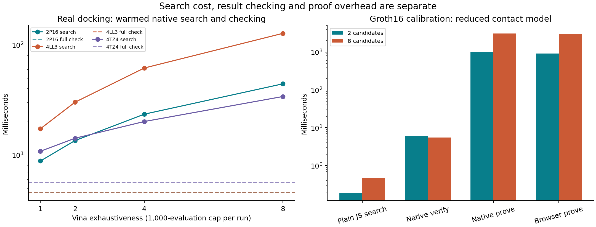

# Docking, cheap rescoring and Groth16: measured feasibility

## Decision

**Docking is a plausible useful-output workload, but score-only verification cannot enforce risk-scaled search effort. Groth16 can prove a specified bounded search; our first browser proof works, but only for a reduced contact model, and does not yet justify a docking-based access gate.** Continue with a bounded proof-of-search experiment as research. Keep native Vina rescoring as the scientific-output baseline. Neither component is ready to replace the current admission mechanism.

This is an implemented pilot, not an architectural proposal alone: 63 native searches, 13 browser searches, independent rescoring, deliberate effort substitutions, and actual Groth16 proofs generated in Node and Chrome. The [evidence and reproduction guide](../evaluation/docking_pilot_2026-09-06/README.md), [raw summary](../evaluation/docking_pilot_2026-09-06/summary.json) and [public pose corpus](../evaluation/docking_pilot_2026-09-06/pose_corpus.json) accompany the code. All inputs are established public benchmark pairs; no unexplored biological combination or experimentally confirmed binder was discovered.

The original project question remains:

> Can anonymous browsers contribute useful inference work that is verified cheaply, within a bounded access delay, even when some contributors submit malicious results or disappear?

For this candidate workload, substitute “useful search work” when formulating the next experiment, while retaining the original wording in the readiness record. Human labelling and the Cloudflare site remain deferred until the main contribution is selected.

## What scales, and what the verifier knows

Think of searching many possible parking positions and returning one good position. Checking that the returned position is valid can be cheap; it does not establish that the driver inspected the assigned number of spaces.

Let E be search effort per ligand/protein pair, J the number of assigned pairs, and A and R the ligand and receptor sizes. A simplified cost model is:

`client work ≈ J × E × cost_per_search_step(A, R)`

`direct checking ≈ J × cost_per_pose_check(A, R) + preparation + ingestion/state`

Vina's exhaustiveness controls independent search runs, while each run includes heuristic local optimization. Thus approximately linear growth with E is a scheduling interpretation, not an exact bound on all Vina execution paths. The measured curves also include caps and setup. [Vina FAQ](https://autodock-vina.readthedocs.io/en/latest/faq.html)

For a fixed bounded molecule, fixed receptor and one returned pose, checking is approximately constant **with respect to E**. It is not generally constant in molecule size or returned-job count. Direct atom-pair scoring can involve A×R interactions and intramolecular terms; grids and cutoffs change the practical cost. Our preflight also processes coordinates and geometry. Holding dimensions fixed is a useful engineering bound, not a new O(1) algorithm. Vina explicitly separates scoring, local optimization and search. [Vina API](https://autodock-vina.readthedocs.io/en/latest/docking_python.html)

Increasing suspicious users' effort by a quadratic policy, such as E(r)=E0(1+r)^2, is possible. It remains only a requested budget unless checked execution binds that budget. Giving J independent jobs increases useful-output opportunities but also requires J direct result checks. Increasing both the ligand and protein libraries by n creates n² combinations; it does not make one docking job intrinsically quadratic. Some combinations have little scientific value, and revisiting a pair can rediscover the same poses.

## Real docking measurements

Hardware: AMD Ryzen 7 7435HS, 16 logical CPUs, about 23.7 GiB RAM, Windows x64. Native Vina and browser search each use one search thread. Native is Vina 1.2.7; pinned Webina embeds Vina 1.2.3 in Chrome 152.0.7977.76. Source hashes, flags and exact versions are recorded. Webina already establishes browser docking as prior art. [Webina repository](https://github.com/durrantlab/webina)

The following are medians from the final published local run. Search uses a 1,000-evaluation cap; the complete check includes validation, canonical reconstruction, file/IPC transport, pose preparation and native scoring. Native search uses the same prepared receptor/ligand cache. Each search point has three repeated timings with a fixed seed; check counts are 32/22/22, including one rejection. These are descriptive measurements, not population confidence estimates.

| Pair | Prepared native search, E=1 | Prepared native search, E=8 | Complete warm pose check | Initial native preparation |
| --- | ---: | ---: | ---: | ---: |
| Apixaban / factor Xa, 2P16 | 8.84 ms | 44.35 ms | 4.54 ms | 959 ms |
| Darunavir / HIV protease, 4LL3 | 17.35 ms | 127.41 ms | 4.55 ms | 1,141 ms |
| Lenalidomide / cereblon, 4TZ4 | 10.84 ms | 34.02 ms | 5.62 ms | 793 ms |

The score arithmetic alone averaged 0.052–0.111 ms. Reporting only that kernel would substantially understate the server path. The final run's mean complete checks are 4.61–6.05 ms, with scheduling/file overhead and variation between development runs. Small searches offer only modest absolute savings; a few milliseconds of additional endpoint cost can erase them. A cache miss incurs preparation, so a queue of new pairs cannot assume this cost has already been amortized indefinitely.

Fresh-worker browser runs at the short cap took 1.39–2.17 seconds and allocated approximately 429–612 MiB of WASM linear memory. This is allocated addressable memory, not a measured peak resident-memory or energy figure. One standard-search apixaban browser run (E=1, no evaluation cap) took **6.60 seconds** and returned a 3,674-byte pose.

Native fresh-process apixaban searches without the evaluation cap had medians **9.14, 19.50 and 41.09 seconds** at E=1,2,4, respectively, over three seeds each. Those totals include setup. Different engine versions and paths prevent a direct native/browser speed ranking. More effort did not improve every seed's score; convergence and scientific ranking quality are not established by timings.

This port therefore has not demonstrated a dependable 1.5-second access delay for meaningful docking. Reusing browser preparation or improving the WASM port might help; neither was implemented here. Do not infer that all browser docking is inherently incapable of shorter latency from these fresh-worker measurements.

### Validation and malicious submissions

The local envelope caps the input at 16 KiB and one pose, fixes atom identities/types/charges and torsion-tree structure, checks finite coordinates and the grid box, and checks rigid-fragment and inferred local geometry. It reconstructs the accepted chemistry from trusted input before native scoring. This is not a complete chemistry validator or an exposed API.

All **62 valid native poses** agree with separate stock CLI rescoring within **0.0005 kcal/mol**, the CLI's rounding precision. All 13 browser poses meet the 0.05 kcal/mol tolerance. One of the 63 native poses fails stock and cached scoring after output rounding at the grid boundary; the failure is retained. The latest verifier asserts the score tolerance for every accepted recorded pose.

| Deliberate submission | Observed result | Consequence |
| --- | --- | --- |
| Invented score on a valid pose | Rejected for all three pairs | Independent rescoring checks the score claim |
| NaN, out-of-box, distorted geometry, missing atom, oversized payload, altered torsion count | Tested mutations rejected before scoring | Cheap envelope validation reduces these malformed cases |
| E=1/capped result presented as E=8/uncapped work with another seed | Accepted for all three pairs | Score checking does not bind search budget or seed |
| Cached pose translated by 0.002 angstrom | Accepted, with a different exact hash, for all three pairs | Exact hashes do not establish new scientific progress |

Symmetry-aware RMSD clustering, campaign-wide result deduplication and output-quality thresholds would improve useful-result accounting. They still would not prove an exhaustive search or a minimum amount of CPU time. The translation experiment illustrates a defect in hash-only novelty credit, not a bypass of a deployed service.

## What the Groth16 prototype actually proves

The circuit evaluates an intentionally reduced model: eight ligand atoms, eight nearby receptor atoms, integer coordinates, translations only and a simple attraction/clash potential. It evaluates 2 or 8 seed-derived candidate translations and proves their minimum score and first minimizing index. Public inputs include the seed and coordinates; the tier is fixed by the verification key. It uses range constraints and strict Poseidon field decomposition. Data privacy is not needed for these public inputs; succinct verification is the property being investigated.

This is **not Vina**, does not contain its force field, rotations, ligand torsions or BFGS search, and has no demonstrated screening accuracy. Atom subsets come from a real benchmark only to provide a concrete input. The per-axis translation has six bits, so the candidate domain has at most 2^18 translations; it is explicitly unsuitable as a hardness argument against precomputation.

| Reduced experiment | 2 candidates | 8 candidates |
| --- | ---: | ---: |
| Arithmetic constraints | 13,302 | 51,486 |
| Ordinary JS search, median | 0.191 ms | 0.465 ms |
| Node proof generation, median of two seeds | 1.000 s | 3.121 s |
| Browser proof generation, one run | 0.912 s | 2.970 s |
| Warm Node verification, median | 6.00 ms | 5.53 ms |
| Proving key | 8.16 MB | 31.70 MB |
| Witness WASM | 1.83 MB | 2.00 MB |
| Public field elements | 51 | 51 |

Browser proving includes key/witness fetch from localhost; the JS library was loaded beforehand. Node proving includes reading local artifacts. Network downloads on a real device could add substantially more time. The first browser verification was cold (79.35 ms); the next was 5.35 ms. It should not be confused with the warmed Node series. Proof JSON is about 0.72 KB, excluding the public statement, keys and protocol envelope.

Verifier time stays similar as this tiny circuit grows, but here it is **slower than simply performing the reduced search centrally**. Almost all client cost is proving overhead. We cannot apply Vina's measured search cost to this different circuit to manufacture a favorable speedup.

Groth16's proof has three group elements; verification has a constant number of pairings plus work proportional to the public statement. “Constant in search length” therefore requires a bounded public interface and a fixed security parameter. A commitment to a larger dataset can keep the interface small, but proving that the computation uses the committed data adds circuit/prover work. Reading, checking and storing J useful outputs remains output-sized work even if a succinct proof checks their computation. [Groth, EUROCRYPT 2016](https://discovery.ucl.ac.uk/id/eprint/1501201/1/Groth_SNARK9.pdf)

Six published Node/browser proofs independently verify; **27 public-input, corrupted-proof and cross-tier substitutions are rejected** by the portable evidence checker. The main generation benchmark separately checked its outputs against ordinary JS search and rejected 17 tampering cases. These are implementation tests, not a formal circuit audit.

An initial development setup omitted random contributions and was degenerate: altered public statements could verify. Negative testing caught it. That diagnostic is preserved separately and excluded from all final performance/security conclusions. The final keys use random single-party phase-one and phase-two contributions via snarkjs; this is still a development setup, not a production ceremony. Only public proofs and verification keys are published; no proving keys or setup entropy are committed. Follow the [snarkjs setup documentation](https://github.com/iden3/snarkjs) before designing a deployable ceremony.

## Implementation direction and journal gates

1. **Define a demanded campaign.** Choose a curated target and ligand library with a domain collaborator. Validate preparation, scoring/ranking and pose recovery against suitable independent controls. Assign distinct campaign/pair/region IDs; record already explored regions and cluster returned poses. These three benchmark pairs do not establish continuous demand or drug-discovery utility.
2. **Prove the bounded search contract, not only the final score.** A future circuit must bind campaign/data/scoring version, assigned region, fresh challenge, exact tier, search rules and output. It proves a correct result of that specified computation. It does not prove that the client spent a prescribed wall-clock duration, used a particular CPU, or found the global optimum. Model optimized attackers, accelerators, reused subcomputations and precomputed candidates.
3. **Preserve scientific value while making the computation circuit-friendly.** Test a fixed-point grid or contact surrogate against an established docking pipeline before scaling proofs. Do not claim a “Vina proof” unless the implemented relation actually matches the specified Vina computation. Reject the surrogate if its ranking/pose quality is inadequate.
4. **Bound the entire verifier service.** Validate request bytes, field encodings and server-owned task/tier before pairing work; use a finite verification budget, isolated workers with hard deadlines, expiring leases and atomic one-time credit. Fresh proof verification still costs milliseconds, and an attacker can send unlimited invalid proofs without having proved anything. These controls need actual endpoint flood/concurrency tests; O(1) verification alone does not prevent denial of service.
5. **Select effort using measured device/time bounds.** Increase independent bounded work units only while the promised access delay and client resource budget permit it. Reissue abandoned units after leases expire; grant no credit for an unverified partial claim. A voluntary background search lane may be more viable than mandatory long docking. Deadline fallback, accessibility and user consent remain part of the product contract.
6. **Require a demonstrated contribution before the journal pivot.** Compare score-only Vina, a proof of the validated bounded surrogate, ordinary central computation, and the inference baseline under malicious submissions and departures. Include preparation, transfers, public-input size, cold/warm behavior, cache churn, attacker cost and real devices. The plausible contribution is an original mechanism or carefully supported security/cost/availability finding; “docking + Groth16,” caching and risk tiers alone are established ingredients.

The next implementation choice is therefore a scientifically validated bounded search relation plus a measured proof/admission budget. Do not build the human-feedback dashboard first, claim guaranteed acceptance by *Cybersecurity*, or call this pilot a secure useful-work CAPTCHA. It establishes feasibility of components and concrete failure modes, and identifies the still-unsolved economic and security conditions.
