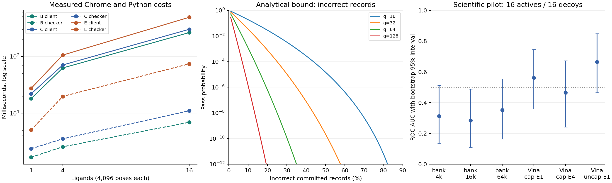

# Lightweight docking: measured findings and protocol decision

Investigation completed 8 September 2026, following the [initial checkpoint](LIGHTWEIGHT_DOCKING_WORK_2026-09-07.md). [Evidence and reproduction](../evaluation/docking_lightweight_2026-09-07/README.md), [all timing tables](../evaluation/docking_lightweight_2026-09-07/tables.md), [source ledger](LIGHTWEIGHT_DOCKING_SOURCES_2026-09-07.json). Directory names retain the starting date.

> Can we make attacker cost scale with the amount of assigned USEFUL docking work while keeping server verification much cheaper and keeping cryptographic/non-useful client overhead a minority of total work?

## Recommendation

**Keep lightweight audits and multiple independent ligand jobs as the experimental architecture. Do not return to full Groth16 by default. Do not deploy the current coarse pose bank as useful-work admission.** The cost curve is promising, but this particular bank fails the scientific-quality gate. The protocol supports conditional bulk-record assurance, not unconditional fresh CPU expenditure or an exact global minimum.

The strongest measured results are:

- **16 ligands × 16,384 poses:** Chrome takes **1.04 s with scalar audits**, with a **94.1% molecular-kernel fraction** and **8.97 ms warm Python checking**. Per-atom audits take **1.10 s**, **88.4%**, and **11.84 ms**. These exclude Internet transfer and database operations.
- **60 partial-work wire attacks were rejected**, and all 12 full-work controls passed. Analytical probabilities and 10,000-trial simulations are recorded separately; zero observed accepts is not a negligible-error theorem.
- **Four cached-science/fresh-commitment attacks passed with zero new molecular evaluations.** New lease bindings reject old proofs but do not erase scientific caches.
- **All 12 attacks hiding one true best pose passed**, including the block-winner hybrid. Most records can be correct while the scientific answer is sabotaged.
- The largest coarse bank reaches pilot ROC-AUC **0.352**, versus **0.664** for uncapped Vina E1; intervals are broad and overlap. In a separate known-bound-conformer redocking control, its selected pose is **9.05 Å** from the crystal pose, versus **0.44 Å** for Vina E4.

The lightweight design is therefore **conditionally salvageable**, but we have not yet demonstrated the conjunction of effective molecular science and enforceable fresh effort. The next molecular experiment should use scientifically effective independently restartable search units and audit entire selected units. That proposal is not an implemented result. Generic optimization certificates do not automatically solve the fresh-effort problem either.

## 1. Implemented molecular workload and protocols

### Molecular preparation and numerical checks

Downloaded DUD-E FA10 receptor, crystal ligand, active and decoy libraries. Before docking outcomes, selected 16 size-stratified unique molecules from the first 96 eligible entries of each class. The 32 ligands contain 23–43 heavy atoms. Decoys are presumed nonbinders, not experimental negative labels. This is a single-target pilot, not a full DUD-E or prospective discovery evaluation. [DUD-E FA10](https://dude.docking.org/targets/fa10)

RDKit generates up to three additional conformers per ligand with fixed seeds and MMFF optimization; the source conformer is retained. Meeko prepares atom types. The historical receptor PDB required repaired element columns and rebuilt hydrogens; every receptor heavy atom was retained. A helper linked to pinned Vina 1.2.7 exports affinity maps. A Windows CRLF text-read problem encountered in upstream ligand loading was avoided by streaming the input into Vina's string API.

The bank combines 3–4 conformers, 128 fixed-seed rotations and 512 translations around a known pocket. A fixed coprime permutation maps assigned ranges to unique bank indices. Each ligand has 196,608 or 262,144 available indices. Preparation verifies that every generated pose fits within the 30 Å box; out-of-box poses are not replaced with an easily guessed constant.

The objective is **fixed-conformer intermolecular Vina-map energy**, using explicit integer coordinates, eight-corner interpolation, eight-bit fractional weights, energy scale 10,000 and rounded positive-energy curl. It omits flexible optimization, intramolecular scoring and Vina's torsional normalization. It is not full Vina. Rigid grid screening of conformationally expanded libraries is scientifically established, but that does not validate our exact bank. [Official DOCK tutorial](https://dock.compbio.ucsf.edu/DOCK_6/tutorials/ligand_sampling_dock/ligand_sampling_dock.html)

Preprocessing constructs maps, types and conformers, **not all candidate energies**. Its time and delivery remain real costs. On 128 checked poses, native Vina and the floating map evaluator agree to maximum absolute difference **2.84 × 10⁻¹³**; the integer objective differs by at most **0.03791**. Optimized C++ and Python agree exactly on all output atom records for 16 ligands at 32/4,096 poses. These validate the implemented arithmetic, not binding accuracy.

### A–F definitions

| Design | Implemented behavior | Scope |
|---|---|---|
| A | Vina search, return a pose, independently rescore it | New native 32-ligand controls; prior browser Vina measurements use different examples |
| B | Independently determined poses; commit scalar scores before random challenges; check samples and claimed winner | Node and actual Chrome |
| C | Commit per-atom contributions in 64-pose Merkle blocks; open challenged blocks; recompute sampled contributions and winner | Node and actual Chrome |
| D | Full Groth16 over the previously measured restricted published CPD relation | Historical measured control; **not a full proof over this docking bank** |
| E | C plus direct checks of each claimed 64-pose block winner | Implemented small-check hybrid; no token SNARK over unauthenticated scientific data |
| F | B/C/E over 1, 4 or 16 different ligands and disjoint assigned ranges | Node, Chrome and transactional scheduler prototype |

B and C send the complete scalar score vector and bind its hash to the commitment. This permits a cheap minimum reduction over the **submitted** vector. C additionally commits the natural per-atom contributions, checks their sums and independently recomputes challenged rows. The server issues 32 atom-count-weighted random draws with replacement after commitment, plus one winner check per ligand.

B already sends all scalar records, so its Merkle openings are redundant: a production B protocol could bind the vector directly. That optimization was not measured. We retained common block mechanics for comparison. C can rule out some aggregate-score guesses, but **B and C both had zero correct skipped-record guesses in our tested attacks**; this experiment did not demonstrate a work-enforcement benefit that justified C's extra bytes.

E checks the winners the client reports. If the client inflates a true optimum's record, it can nominate a different correctly scored winner. This explains why E costs substantially more without certifying the true minimum.

## 2. Scheduler and security claims

### Scheduler behavior

The SQLite scheduler tracks UNASSIGNED, LEASED, COMPLETED and EXPIRED units. It leases bundles of distinct ligands, permits one commitment and one unpredictable challenge per live lease, and atomically records completion/one credit. Expired or rejected uncompleted work is reassignable; a completed range in the same scientific family is not deliberately leased again.

Scientific identity binds model, receptor, ligand, conformer bank, region and search parameters. Campaign labels are excluded, so renaming a campaign cannot create fresh work. The trusted builder must canonicalize scientific identity: semantic aliases, irrelevant version changes and alternative encodings of identical science are not automatically detected. Verification policy should not manufacture a new scientific family.

Eight tests pass, including concurrent disjoint leasing and a 16-way completion race. Actual Node computation, Python checking and SQLite processing completed two bundles/four jobs, rejected repeated credit and exhausted the completed pool. The acceptance decision is internal to the trusted verifier. Owner strings are not authentication or Sybil resistance. Deliberate validation replicas are not implemented; they would require separate accounting rather than fresh-work credit.

### Distinguish three properties

1. **A pose has its stated score under the chosen model.** Recompute that pose. This establishes neither experimental binding nor optimality.
2. **Most committed records are correct.** Random audits give a statistical bound against a specified amount of incorrect committed data.
3. **The assigned useful computation was newly performed.** This additionally needs assumptions about guessing, caches, amortization and the fastest available algorithm. Neither sampling nor a complete correctness SNARK establishes it automatically.

For M fixed records with b wrong entries and q uniformly sampled distinct indices after commitment:

`P(pass random checks) = choose(M-b,q) / choose(M,q) ≤ (1-b/M)^q`.

With independent cost-weighted sampling with replacement, let β be the fraction of **estimated work weight** on incorrect records:

`P(pass random checks) = (1-β)^q`.

Mandatory winner checks can only reduce acceptance. Sampling is implemented in O(J + q log J) for J jobs using cumulative weights and binary search, without materializing every candidate. The scheduler also supports uniform sampling without replacement.

The previous one-forged-transition shortcut does not transfer directly: each pose is independently derived from the server's bank and range. A false earlier record cannot redefine the next pose. However, any faster algorithm that supplies the **correct** records still passes.

If an attacker computes fraction f and can correctly supply at most fraction g of omitted records through other means, equal-cost with-replacement sampling yields the conditional bound:

`P(pass) ≤ [f + (1-f)g]^q`.

This is an attacker model, not a theorem that all omitted molecular work is hard. Correlations, score predictability and preprocessing must be included in g. If estimated costs are between l and u times actual costs, a true wrong-work fraction α only guarantees estimated fraction at least `lα / [lα + u(1−α)]`.

| Incorrect fraction, assumed equal to skipped work | Pass probability, q=32 | q for ≤10⁻⁶ |
|---:|---:|---:|
| 90% | 10⁻³² | 6 |
| 75% | 5.42 × 10⁻²⁰ | 10 |
| 50% | 2.33 × 10⁻¹⁰ | 20 |
| 25% | 1.00 × 10⁻⁴ | 49 |
| 10% | 0.0343 | 132 |
| 1% | 0.725 | 1,375 |

These are analytical values, not observed acceptance rates. The prototype caps q at 128, so it cannot reach the last two 10⁻⁶ targets with replacement. The design is better suited to substantial omission than to detecting one strategically altered result.

### Retries and overload

For per-attempt success p, M independent attempts succeed at least once with `1−(1−p)^M`. A lease cannot obtain a replacement challenge, and late credit fails. But abandoned leases/new identities remain possible: global quotas, authenticated admission and verification queues are outside this local prototype.

Under the simplified model of cost proportional to correctly computed fraction f, no cache and no correct guessing, expected cost per accepted request scales as `f/f^q = f^(1−q)`. For q>1, omission does not improve that expected cost. This conditional incentive argument does not cover an attacker trying to exhaust the server rather than gain access.

Request byte caps, cheap lease/state checks before molecular work, bounded outstanding leases, queue budgets and atomic token redemption remain essential. No verification primitive makes server cost zero. No production HTTP load or Internet deadline guarantee is claimed.

## 3. Measured costs

Three repetitions per architecture/tier in Node and headless Chrome. The independent Python checker validates returned openings. Full stage breakdowns and the 256/1,024-pose cases are in the [derived tables](../evaluation/docking_lightweight_2026-09-07/tables.md).

| Protocol | Ligands × poses | Chrome client ms | Molecular-kernel fraction | Python checker ms | Client→server KiB |
|---|---:|---:|---:|---:|---:|
| B | 1 × 4,096 | 18.1 | 89.3% | 1.68 | 42.8 |
| B | 4 × 4,096 | 62.7 | 95.4% | 2.57 | 112.1 |
| B | 16 × 4,096 | 262.9 | 95.8% | 6.94 | 380.0 |
| C | 1 × 4,096 | 22.0 | 64.4% | 2.37 | 265.6 |
| C | 4 × 4,096 | 70.7 | 79.3% | 3.55 | 413.1 |
| C | 16 × 4,096 | 300.5 | 85.3% | 11.05 | 864.4 |
| E | 16 × 4,096 | 488.4 | 51.8% | 74.05 | 11,489.7 |
| B | 4 × 16,384 | 244.0 | 91.2% | 3.24 | 373.5 |
| B | 16 × 16,384 | 1,044.7 | 94.1% | 8.97 | 1,411.9 |
| C | 4 × 16,384 | 244.2 | 87.6% | 4.58 | 685.8 |
| C | 16 × 16,384 | 1,101.3 | 88.4% | 11.84 | 1,898.8 |

Columns are separate medians; fractions are median paired ratios. Client time includes actual scoring, commitments and opening serialization. The score-only reference measures the same molecular objective without retaining atom records; diagnostic reference reruns are excluded from reported client cost. Asset loading, dispatch, browser/harness marshaling and RTT are excluded. Python checking starts with parsed JSON; database costs are separate.

**Verification is not asymptotically constant in this implementation.** For J jobs with N poses each, the complete scalar vectors impose O(JN) transfer, hashing and minimum-reduction work. B/C independently recompute at most q + J poses; C also checks the opened atom records, and Merkle paths add logarithmic overhead. E additionally recomputes up to one winner per 64-pose block. The measured small increase in checker time reflects cheap vector processing relative to molecular evaluation, not a proof of constant-time verification or a denial-of-service bound. A root-only protocol could reduce vector traffic but would need a separate solution for trustworthy scientific selection.

**The kernel fraction is not a validated scientific-utility fraction.** It shows that non-molecular overhead can be a minority. The quality experiments show this particular arithmetic workload does not yet provide effective screening.

**A, native Vina:** uncapped E1 takes median **14.26 s**, range about **4.3–23.5 s**, plus median **654 ms per-ligand initialization**; maps are additional preprocessing. Capped E1/E4, serialized output sizes and score-check times are recorded. One capped serialized pose was rejected as outside the box rather than silently accepted. Score checking has no test for the requested exhaustiveness, so a correctly scored low-effort/cached pose is still a substitute. The prior browser Vina examples are historical, different-workload measurements.

**D, historical full Groth16 CPD64:** plain Node BigInt search **0.459 ms**, proving **1,448.8 ms**, warm verification **7.395 ms**, proof/public JSON **783 bytes**, proving key **17.42 MB**. Previously measured Chrome proving was **1.422 s**. The molecular-model fraction is about **0.032%** by this proxy. These files were re-inspected; proving was not rerun. This is a complete proof of a different restricted scientific relation, not a same-bank docking benchmark. No full-grid SNARK timings were fabricated or extrapolated from CPD. [Prior evidence](BOUNDED_SEARCH_DIFFICULTY_LADDER_2026-09-07.md)

The comparison therefore includes all A–F designs, but it is not six browser implementations of one identical objective. A/D new same-bank browser/proof implementations remain absent.

### Full service costs, transfer and memory

The two-job SQLite flow takes approximately **23–26 ms total server time** across lease, header/challenge, scientific verification and durable credit; only **2.5–2.7 ms** is scientific checking. Checker-only timings must not be advertised as complete service latency.

Maps occupy **27.63 MB**, or measured **15.18 MB with gzip-6**. Bandwidth-only projections are **12.15 s at 10 Mbps** and **1.21 s at 100 Mbps**, before code/metadata and RTT. The measured uncompressed loopback Chrome load of roughly 166 ms is not an Internet download measurement. Cold visits need asset-delivery redesign before the short-delay target is credible.

Owned typed arrays for 16 × 16,384 are **27.35 MiB for B** and **58.73 MiB for C**, including maps. The full Chrome suite sampled about **1.14 GB RSS**, including browser infrastructure and the Node harness retaining many transcripts; that is not a per-assignment peak. E's full block-winner openings cause much greater traffic. There are no phone, GPU or background-tab measurements.

An optimized C++ control executes the same 16 × 4,096 scoring workload in a summed **86.54 ms**, versus roughly **252–262 ms** of Chrome kernel time. An attacker can use that measured runtime advantage. Native 32-pose kernel batches take **0.022–0.072 ms** per ligand, excluding loading and protocol checks; these are not native end-to-end verifier measurements.

Atom-count calibration over the 32 Python batches has median leave-one-out relative error **11.6%**, worst **96.9%**. Atom count is a useful initial feature, not a deadline or hardness certificate. Rotatable bonds do not add operations to this fixed-conformer kernel, but affect flexible search and preparation; conformer count changes available bank coverage. Runtime bands must be calibrated per implementation/device.

## 4. Attack outcomes

The partial attacker computes real selected poses, then fills omitted rows with an evaluated high-energy record. It computes an anchor in every block so every claimed block winner can remain genuine. The full truth array is generated independently by the harness and is unavailable to the partial attacker. Fractions round to whole entries in 64-pose blocks.

Representative actual Node C attack, one 4,096-pose ligand:

| Actually computed | Attacker client ms | Conditional q=32 pass probability |
|---:|---:|---:|
| 9.375% | 13.47 | 1.27 × 10⁻³³ |
| 25% | 14.77 | 5.42 × 10⁻²⁰ |
| 50% | 21.61 | 2.33 × 10⁻¹⁰ |
| 75% | 24.79 | 1.00 × 10⁻⁴ |
| 89.0625% | 28.15 | 0.02456 |
| 100% | 27.69 | 1 |

These single-run costs include scoring, fabrication, commitment and openings; noise is visible. Across four ligands and B/C/E, 60 partial wire attempts failed and all 12 full-work controls passed. Separate 10,000-trial simulations sample each committed correctness mask. Copying omitted records yielded zero additional correct guesses. A nearest-grid-corner shortcut yielded **zero exact scalar or atom-record matches across 16,384 poses**. This limited attack set is not a proof against every approximation.

For 16 heterogeneous jobs, computing the eight smaller ligands and one real winner anchor for each remaining ligand produces a calculated q=32 probability **2.35 × 10⁻¹⁰** with uniform record sampling, versus **1.25 × 10⁻¹¹** with atom weighting, assuming all other records are wrong. This row measures actual selected kernel cost plus an analytical bound; it is not an extra full wire attack.

Successful attacks clarify the boundary:

- **Cached science, fresh commitment:** four cached arrays were recommitted under new bindings and accepted in **8.3–10.1 ms**, with **zero new scoring**. Old-root substitution fails; a new commitment to old science succeeds.
- **Hide the optimum:** replace just the true minimum's row with a high-energy row, then nominate the next best pose. All 12 B/C/E variants passed. The chance of missing one incorrect entry is `(1−1/4096)^32 ≈ 0.9922`. This attack expends useful work but sabotages scientific selection.
- **Malformed/replayed protocol:** 52 variants of wrong binding/range/mode/root, altered score/row, wrong path, duplicate/missing chunk, oversized data or malformed schema were rejected. Scheduler tests cover owner, repeated commitment, challenge, expiry and duplicate-credit races. This is not exhaustive parser or HTTP testing.

There are **198 accepted honest audit transcripts**, not 198 full recomputations of every bank. The checker recomputes sampled records and required winners; hashing and row-sum checks do not independently verify every omitted score.

## 5. New scientific work and caching

| Case | What is established | Remaining limitation |
|---|---|---|
| Completed exact assignment | Same registered family/range is not reissued; credit is one-use | Trusted canonicalization must prevent semantic aliases |
| Disjoint ranges | Four measured pairs of adjacent 4,096-pose ranges have zero duplicate quantized poses | Not a theorem for all symmetries/campaigns |
| Atom interpolation reuse | Zero exact tuple reuse across those four range pairs | Larger caches, factoring, approximation and GPU/SIMD were not exhausted |
| Receptor/conformer preparation | Explicitly reusable and accounted separately | Cannot be charged as new work each lease |
| Shared answers | Correct pooled answers are valid | No proof an individual browser performed them |
| Expired leases | Only unfinished work is reassignable | The first holder may have completed it before disappearing |
| New lease/nonce | Prevents substitution of an old transcript | Does not make unchanged scientific values new |
| Faster hardware/algorithm | Native speedup is measured; correct output still passes | No hardware-independent wall-clock difficulty |

**The unconditional lower bound on new evaluations per accepted request is zero.** Under an explicitly initially empty cache, disjoint inputs and a bounded correct-guess/shortcut model, a conditional cost-per-accepted-request argument becomes possible. Those assumptions must be tested, not hidden.

Campaign-level novelty differs from fresh-per-request CPU: an attacker may precompute a campaign, later return results that are new to the server, and still do zero new science during each lease. That can satisfy useful-output accounting while violating fresh-effort accounting. A finite public benchmark pool cannot run indefinitely; externally demanded new campaigns and exhaustion behavior are essential.

## 6. Scientific-quality gate

| Method | ROC-AUC | Stratified bootstrap 95% interval | Actives in top four |
|---|---:|---:|---:|
| Coarse 4,096 | 0.313 | 0.137–0.512 | 0 |
| Coarse 16,384 | 0.285 | 0.109–0.488 | 1 |
| Coarse 65,536 | 0.352 | 0.164–0.555 | 1 |
| Vina capped E1 | 0.563 | 0.359–0.746 | 3 |
| Vina capped E4 | 0.465 | 0.242–0.672 | 3 |
| Vina uncapped E1 | 0.664 | 0.465–0.848 | 4 |

The stronger uncapped control uses the same selected molecules and fixed seed. Intervals use 2,000 bootstrap resamples and overlap; they do not prove general superiority. The preselection procedure, one target and presumed decoys limit inference.

Redocking is more diagnostic: Vina E4 gives **0.443 Å symmetry-aware RMSD without alignment**, while the coarse bank selects **9.054 Å**. Even its minimum atom-index coverage is **2.335 Å**, before score-based selection. This optimistic control provides the bound conformer; the original crystal orientation is not deliberately inserted into the random rotation bank. Independently generated conformers are harder. Merely evaluating more translations from the same limited rotation/conformer set is not an adequate repair.

Legitimate docking uses appropriate orientation matching, conformational coverage, refinement and scoring. Hierarchical reuse and minimization can improve science and computational efficiency; they cannot be forbidden simply to support an effort claim. [Hierarchical docking](https://pmc.ncbi.nlm.nih.gov/articles/PMC1364474/), [sampling research](https://pmc.ncbi.nlm.nih.gov/articles/PMC3787967/).

## 7. Prior art and alternative mechanisms

The closest identified work is **Wander, Weis and Wacker (2011)**: independent scored search slices, random checking, score-guessing assumptions and aggregation tradeoffs. Its requirement for sufficiently informative scores is directly relevant. Full-record commitments avoid relying only on whether samples beat a reported toplist, but Merkle commitments, sampling and the probability formula are established ingredients. We have not established novelty merely by applying them to docking. [Author manuscript](https://wander.science/paper/2011_Wander_CheatDetection.pdf)

| Mechanism | Relevance and limitation |
|---|---|
| Volunteer spot checks, voting, credibility | Established statistical integrity/recovery; replication and identity/collusion assumptions matter. [Sarmenta](https://www.sciencedirect.com/science/article/abs/pii/S0167739X01000772), [BOINC](https://boinc.berkeley.edu/boinc_papers/locality/text.php) |
| Molecular volunteer scheduling | Real molecular tasks and atom-based workload estimates already exist. [SDDF](https://www.nature.com/articles/s41598-025-90981-6) |
| Cut-and-choose / known-answer spotters | Can detect bad work if spotters are indistinguishable; preparing/repeating them costs work, and identifiable/cached spotters weaken detection |
| Checksums, fingerprints, Freivalds | Effective for suitable algebraic relations; hashing fabricated scores does not authenticate unknown truth. Grid lookup, rounding, curl and minima require separate treatment. [Slalom](https://arxiv.org/abs/1806.03287) |
| GKR, sumcheck, PCP-style checks | Global consistency can have favorable asymptotics; lookup authentication, input access and constants still need a docking implementation/benchmark. No minority-overhead claim is made here. [GKR](https://eprint.iacr.org/2020/1247), [Libra](https://www.iacr.org/archive/crypto2019/116940229/116940229.pdf), [rounding proofs](https://doi.org/10.1109/ACCESS.2022.3223136) |
| Learning/checkpoint proofs | Plausible optimization checkpoints can admit cheap spoofing. Raw transition samples are not a generic work theorem. [EuroS&P analysis](https://arxiv.org/abs/2208.03567) |
| Retrievability/encoded records | Possession or recoverability does not establish fresh correct scientific computation. [Compact PoR](https://eprint.iacr.org/2008/073.pdf) |
| Dedicated PoW/VDF | Better-specified hardness/delay, but the imposed work is not molecular. A small separate puzzle does not certify the attached docking budget. [VDF](https://eprint.iacr.org/2018/623.pdf) |
| Fine-grained or jointly designed optimization PoUW | Explicit non-amortization/security is possible for particular constructions; theorems do not transfer to arbitrary docking. [Updated BRSV](https://eprint.iacr.org/2018/559), [Ofelimos](https://eprint.iacr.org/2021/1379), [FRLS](https://eprint.iacr.org/2025/2091) |

SAT/MaxSAT/MIP or protein-design certificates establish valid answers or optimality bounds. They do not force a solver runtime, guarantee a hard instance, eliminate caching, or ensure completion by a short deadline. Security witness search can cheaply validate a found witness but may find none; proving full negative coverage is a separate problem. Certified optimization is stronger only when difficulty and non-amortization are designed and justified, not merely because the problem is NP-hard.

This is a targeted primary-source investigation, not a claim of exhaustive literature coverage. Some alternative proof/optimization systems were reviewed only at abstract/design level; the ledger identifies that limitation. No new cryptographic theorem is claimed.

## 8. Next journal milestone

1. **Use B + F as the baseline to beat.** Its overhead is already a minority. Keep C as an ablation until an actual attack advantage justifies its bandwidth. E is not the default: it is expensive and still fails hidden-optimum sabotage.
2. **Replace the scientific unit before deployment.** Investigate bounded independently seeded local docking/refinement runs, or scientifically sourced pose ensembles with effective placement. Commit each unit's output and audit entire selected units; do not return to raw edge sampling. Whole-unit replay might lose the cost advantage, so measure it alongside equal-budget scientific quality. This is proposed work, not a completed implementation.
3. **Choose the security property explicitly.** Statistical resistance to substantial omitted work under a cache/algorithm model does not require full SNARKs. Certifying every score/global reduction requires sound global verification or full checking. Proving newly spent effort additionally needs freshness/non-amortization; a correctness SNARK alone is insufficient.
4. **Keep novelty unresolved until demonstrated.** A plausible contribution is a new analyzed work-to-record relationship or audit allocation rule that survives shared-cache/native attacks while preserving scientific utility. The current artifact supplies boundary measurements and counterexamples, but not that new guarantee or journal acceptance.
5. **Complete the remaining gates:** multiple targets, stronger attacker implementations, cold asset delivery, phones/background execution, production concurrency/deadline/abandonment, authenticated bounded admission and independent reproduction. Human feedback, retraining and the shared website remain downstream of this contribution decision.

The experiments demonstrate a minority-overhead molecular audit and a computational difficulty ladder under a conditional record model. They do **not** yet demonstrate effective scientific docking with enforceable fresh effort. Full Groth16 is neither the necessary next step nor a cure for this remaining gap.
