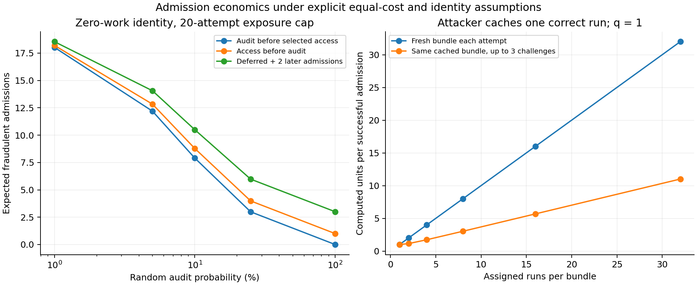

# One-run admission policy: what the outer layer must buy

The practical choice is **unpredictable immediate replay on a small fraction of
already-trusted one-run visits**, with strict exposure limits. Selected visitors
wait for replay; unselected visitors receive access. Scientific outputs remain
provisional independently of that access decision. Use mandatory sampled replay
of multi-run bundles for untrusted or higher-risk visitors.

This is a recommendation backed by analytic and Monte Carlo models, not a
deployed policy or an empirical measurement of identity acquisition cost. The
Vina search, scheduler, finalizer and whole-run audit are unchanged.

## Comparison

One normalized work unit means one correctly executed assigned run. The model
assumes warm server replay costs the same as client execution; hardware differences,
initialization, transfer and control-plane costs must be measured separately.

| Policy | Honest molecular work / expected replay | Fresh zero-work first-attempt access | Consequence |
|---|---:|---:|---|
| One run, immediate random audit with p=5% | 20:1 | 95% | Conditional on outer identity/reputation costs |
| One run, access first and deferred audit with p=5% | 20:1 | 100% | A later ban cannot recover consumed access |
| Delayed provisional access, selected visits blocked until replay | 20:1 | 95% | Same security as immediate random audit |
| Predictable audit every twentieth visit | 20:1 | Attacker knows which visits require work | Adaptive attacker computes only every twentieth visit |
| Two-run bundle, one mandatory random replay | 2:1 | 0% | Fresh bundles require expected two computed runs per success; cached retries weaken this |
| Four-run bundle, one mandatory random replay | 4:1 | 0% | Better asymmetry, longer honest visits |
| Four-run bundle, two mandatory random replays | 2:1 | 0% | Stronger rejection of partial work, more server work |

Fresh zero-work probabilities assume the client commits a detectable invalid
output and each selected replay detects it. They exclude successful prior
precomputation, collusion and shortcuts. Those have separate cost models.

An arbitrary delay is not a substitute for verification. If a provisional user
can perform the valuable protected action during that delay, count the access as
already granted and use the deferred column.

## Exposure and identity cost

For a persistently cheating identity, let T be the first selected audit,
T~Geometric(p), and K the maximum attempts before trusted eligibility must be
renewed. Immediate audit admits min(T-1,K) fraudulent requests. At p=.05 and K=20,
the expectation is **12.1888** bad admissions. With deferred access and no verdict
lag it becomes **12.8303**; allowing two further admissions before the verdict
raises it to **14.0557**.

If trusted identity acquisition costs B normalized run-equivalents, immediate
random auditing therefore imposes B/12.1888 identity cost per successful bad
admission in this example. With B=0 that lower bound is zero. With a one-attempt
identity, cost is B/.95. Reputation is an assumption to measure, not a number to
invent. Account farming, rented accounts, compromised accounts and switching
networks can make the effective B smaller than honest signup effort.

For example, five honest runs to obtain trust followed by a twenty-attempt
deferred cheating episode cost only 5/12.8303 = **0.390 run-equivalents per bad
admission**, before adding acquisition costs. A farming requirement must be
priced against the exposure it unlocks; merely having a reputation score does
not establish deterrence.

## Why bundles are different

For N committed outputs of which c are correct and q uniformly selected audits
without replacement, P(pass)=C(c,q)/C(N,q). For q=1, P(pass)=c/N. With fresh unique
assignments each retry, expected computed work per successful admission is
c/(c/N)=N for c>0. For q>=1 the corresponding cost is at least N under this
equal-cost unit model. The implementation model enumerates all c for
N=1,2,4,8,16,32 and q=1,2,4 where defined.

This is an expected cost argument, not proof that every accepted client executed
all N runs. It depends on scientific units not being reusable for new credits,
the challenge being unpredictable until commitment, and a correct output
actually costing a run. The campaign's one-use unit identity and retry limits
matter. Repeated attempts against a cached partially computed bundle do not
satisfy the fresh-assignment assumption; the existing per-unit attempt cap must
be included in any deployed calculation.

For the existing cap R=3, caching a c-run partial bundle and retrying it yields
success probability 1-(1-P(pass))^3. At N=4, q=1, c=1 this is 0.578125, so the
attacker needs **1.730 computed runs per successful admission**, rather than four.
At N=2 the corresponding cost is **1.143**. For q>=1, the union bound gives a
weaker general bound N/R for this cached-bundle strategy, and that still scales
linearly with N when R is fixed. The model checks 600 such capped-retry settings
against Monte Carlo. Neither the fresh-bundle bound nor the retry bound covers
an algorithmic shortcut that makes an individual correct output cheaper.

The actual SQLite scheduler experiment ran 1,000 four-run campaigns, changing
identity after unfavorable challenges and abandoning those leases. It admitted
585 campaigns, versus 578.125 expected, across 2,307 commitments and 1,722
abandonments. The observed modeled work cost was 1.709 units per success, close
to the predicted 1.730. All global retry-cap and completed-alias checks passed.
Replay verdicts used fixture bytes rather than fresh docking, so this validates
the scheduler attack path and probability model, not molecular execution costs.

Selective abandonment lets a client discard an unfavorable challenge. It does
not improve the pass probability per commitment. It can save the server from
replaying abandoned submissions, but consumes issuance capacity and must count
against identity/lease limits. Do not grant access before a selected challenge
is resolved. Predictable periodic audits are worse: an attacker can arrange to
compute only audited visits and avoid detection entirely.

## Integration requirements found in the current code

The current `research/adaptive_admission.py` starts a new identity at risk zero.
It models bounded-run tiers and trusted verifier completion; it does **not**
implement trusted one-run eligibility or a deferred output workflow. A fresh
zero-risk state must not imply earned reputation. The pool scheduler separately
stores durable provisional outputs and supports digest-bound later replay, but
does not provide the full late-fraud quarantine/revocation workflow.

The smallest practical integration needs:

1. An explicit trusted-eligibility decision from the outer identity boundary,
   separate from absence of observed bad behavior. New/untrusted identities use
   mandatory-audited bundles or an existing outer admission mechanism.
2. A post-commit secret random audit decision, persisted with the lease. A
   selected request remains pending until trusted replay succeeds. Abandonment
   counts as a failed/unfinished attempt.
3. A finite per-identity trusted exposure allowance, maximum outstanding work,
   and global audit-queue backpressure. Saturation must not silently convert
   selected audits into unaudited access.
4. Distinct admission and scientific-validation states. Late failures invalidate
   scientific outputs and affect future eligibility; they cannot undo access.
   Provisional aggregates must not be published as fully verified screening.

These are outstanding integration requirements, not implemented features of the
analysis script. No scientific core or scheduler change was made for this study.

## Decision

The higher-risk bundle architecture remains plausible. A universal claim that
every anonymous one-run visitor must pay meaningful molecular compute while the
server usually skips replay is false under cheap fresh identities. That is a
fundamental limit of the claim, not a docking-specific failure. A scoped hybrid
system can be defensible, provided the paper explicitly attributes low-risk
security to the outer layer and measures the resulting exposure and abuse cost.

The remaining work is consequently more than adding benchmark rows: integrate
and attack-test trusted eligibility, audit backpressure and late scientific
quarantine. Scientific ranking equivalence and physical-phone feasibility are
still separate experimental questions.

Reproduce the model with `python scripts/compare_vina_admission_policies.py`.
It checks 80 policy settings with 200,000 Monte Carlo identities each and
enumerates 200 bundle attacks. All analytic grant expectations agreed with
simulation within six standard errors. This is a model check, not production
throughput or a real adversarial user study.

