# Distributed Vina task decomposition: findings and experiment plan

## Completed decision

**Keep this decomposition as the scientific reference architecture. A visitor does not need to finish an entire docking job.** We implemented separately executable normal Vina Monte Carlo tasks and the original aggregate finalizer. On the FA10 E32 control, all 32 raw task pools and traces, and the final aggregated pose file, exactly matched a monolithic invocation of the same instrumented build. Six earlier four-task comparisons also matched across three targets and two budgets. This is a stronger result than merely combining the best scores from independently finalized E1 invocations.

It does **not** establish a journal-ready short-visit CAPTCHA. A complete normal task can be too long, one-of-one replay has no substantial verification advantage, and the current independent-conformer scientific panel remains weak. Preserve the faithful reference while developing a target-specific campaign and a clearly stated admission/work-credit policy. Do not return to full Groth16 on the basis of these findings.

The completed pilot has **312 aggregate configurations**, including shared prefixes and matched-time reaggregations, not 312 independent experimental replicates. Full measured tables are in [Vina task measurements](VINA_TASK_MEASUREMENTS_2026-09-10.md), with [machine-readable evidence](../evaluation/vina_tasks_2026-09-10/summary.json) and [quality figure](../evaluation/vina_tasks_2026-09-10/aggregate_quality.png).

### What the compute-matched comparison establishes

For the FA10 source crystal, normal E32 used 36,501,755 derivative evaluations and reached 0.466 Å score-selected RMSD. **143 independently seeded 256k-budget runs** used 36,612,738 evaluations (0.30% more) and reached **0.455 Å**. Measured MC times were 373.920 and 338.372 seconds respectively. The closest available time prefix was all 143 runs, still 9.5% shorter than the reference; it is not an exact wall-time match. The downloaded stock E32 binary reached 0.551 Å, with 403.230 seconds of total elapsed time including setup/finalization.

This supports medium-run aggregation on that input, not a general speedup or equivalent screening quality. The earlier execution of the identical 32 normal tasks took 291.274 seconds, versus 373.920 seconds in the control rerun, despite identical outputs. Timing variability prevents a strong throughput conclusion from this one comparison. The broad quality panel compares many shorter runs against **one full normal task's budget**; high-budget ranking equivalence across a large panel has not been measured.

### Scientific quality remains target dependent

| Target | Source-crystal RMSD, 32 normal runs | Independent-conformer RMSD, 32 normal runs | Ranking AUC, 8 normal runs |
|---|---:|---:|---:|
| FA10 | 0.466 Å | 8.770 Å | 0.938 |
| HS90A | 0.484 Å | 0.471 Å | 0.188 |
| TRYB1 | 0.373 Å | 15.184 Å | 0.625 |

The independent FA10 aggregate contains a 1.285 Å pose at rank five, but the scoring function prefers a distant pose. TRYB1's best retained independent pose is still 7.118 Å. These distinguish scoring/selection failure from missing useful sampling. Increasing runs need not monotonically improve score-selected RMSD. The ranking subsets contain only four actives and four decoys each; confidence intervals are broad. The earlier stock HS90A active_00054 timeout is retained, giving stock AUC bounds of 0.188–0.438 rather than silently dropping that ligand. Its new normal eight-run native search took 732.335 seconds.

**No universal smallest scientifically adequate run budget has been established.** The native 16k, 64k and 256k task medians were 0.165, 0.635 and 2.671 seconds. A 64k Chrome task took 0.758–1.011 seconds including its local wrapper/serialization; normal tasks took 12.918–17.440 seconds on that same source FA10 input. Shorter runs can contribute useful aggregate sampling, but the successful source-crystal examples do not validate arbitrary short runs on independent conformers or unseen ligands.

### Browser, scheduler and admission

Warm four-run browser calls spent 98.6% (64k) and 99.5% (normal) of their time in molecular search. Host Node commitment construction took 2.44 and 31.78 ms; these are **not browser commitment measurements**. With q=1, client-call/audit ratios were 3.75× and 4.14×; with q=2 they were 2.40× and 1.86×. One-of-one replay cost 0.683 seconds against a 0.882-second 64k client call, and 16.546 seconds against a 14.198-second normal client call. Six honest audit transcripts passed; a real 64k-output substitution for a normal assignment failed replay.

Cold client map initialization took 4.842 seconds and allocated WASM heap was 576,192,512 bytes (about 550 MiB, not process peak RSS). The normal four-run scientific payload was 2.31 MB; the 64k payload was 190 kB. Network, production database and real-device population costs are absent. Warm useful-work fractions do not imply that cold short visits satisfy the access-delay goal. One earlier browser record is retained as superseded because its single-run timer accidentally included a later attack replay; the corrected rerun drives these findings.

The durable scheduler now supports one or several runs from one pool, and atomic bundles across multiple ligand pools. It stores outputs before credit, preserves canonical merge order, refuses completed work, distinguishes provisional from replay-verified coverage, and supports later verification of an exact stored digest. **32 simulated visitors each contributing one real 16k-cap output** produced exactly the same final merge as direct aggregation. Eight-run and 32-run bundles were also exercised with actual selected replay. These ingestion checks use previously computed work and are separate from the normal E32 quality control. Multi-pool atomicity and alias rejection are covered by regression tests, not a deployed multi-site service.

Regrouping the same measured 64 native tasks into `1 ligand × 8 runs` versus `8 ligands × 1 run` lowered batch-time variation in this fixed panel. At 64k, coefficients of variation changed from 0.528/0.429/0.442 to 0.041/0.038/0.068 for FA10/HS90A/TRYB1. This is reaggregation of measured sequential task times, not a fresh browser or parallel throughput benchmark; mean cost is identical by construction. Mixing calibrated ligands makes a cleaner scheduler budget while spreading progress across eight scientific pools. See [dimension analysis](../evaluation/vina_tasks_2026-09-10/dimensions.json).

For N=32 and q=4, C=16 correct committed outputs pass with probability 5.061%; C=28 pass with probability 56.938%. The implemented short-run-substitution sampling experiment matches this combinatorial model. These are output-correctness bounds, not unconditional proofs of CPU work. Across three cached attempts the latter probability rises to 92.015%. Under the explicit equal-cost/disjoint-bundle model, expected normal work per successful admission remains about 30.43 runs in that case; that is a model-derived quantity, not a measured adversarial lower bound. See the [security model](VINA_TASK_SECURITY_MODEL_2026-09-10.md).

### Recommended next architecture

Use a finite scientific pool per ligand, with original seeded MC tasks and deferred canonical finalization. Calibrate task cost by ligand and budget; the product `ligands × runs × budget` describes assignment dimensions, while admission should use the calibrated sum. Treat low-risk one-run contributions as probabilistic/voluntary scientific credit behind the existing outer gate, or accept the full one-run replay cost. Require larger bundles when the policy needs a replay-cost advantage. Do not claim that auditing a few visitors proves every visitor worked.

First repair/validate the scientific campaign using independently prepared inputs and a larger held-out ranking set; then preserve that exact relation while optimizing reusable maps, task-copy overhead and cold delivery. A resumable normal task could preserve long-run science for short sessions, but its checkpoint state and serial-audit soundness require a separate implementation and analysis. Independent whole runs are currently the cleaner tested security relation. A journal contribution still needs more than established distributed docking and spot-checking: rigorous adversarial economics, scientific validation/repair, real devices, deadline/concurrency evidence and independent reproduction remain open.

## Predeclared experiment and source reasoning

This experiment changes the decomposition, not the acceptance thresholds after looking at results. Vina already defines exhaustiveness as independent MC runs; preserve upstream child RNG allocation, the retained candidate pool (nine modes matching the CLI), merge order, clustering, explicit-receptor refinement and final rescoring. The old single-pose/no-refine adapter is not an exact decomposition of the stock CLI.

```mermaid
flowchart LR
  A[Campaign: fixed input and ordered child seeds] --> B[Lease one or several uncompleted runs]
  B --> C[Browser executes full assigned MC tasks]
  C --> D[Commit raw minima and natural traces]
  D --> E[Server chooses complete runs to replay]
  E --> F[Atomic output storage and one-use credit]
  F --> G[Accumulate runs across sessions]
  G --> H[Original Vina merge, refinement and rescoring]
```

The final merge uses canonical task order, not arrival order. Individual task energies are search intermediates; the aggregate's normalized affinity score is produced by the original finalizer. Received outputs and replay-verified outputs are tracked separately.

Normal runs are already bounded algorithmically even when `max_evals=0`: the pinned source sets outer steps to `G = 105 × (50 + movable_atoms + 10 × degrees_of_freedom)` and local BFGS steps to `L = floor((25 + movable_atoms)/3)`. Each BFGS call makes at most `1 + 10L` derivative evaluations, and an outer step makes at most two such calls. Thus `2G(1+10L)` is a conservative derivative-evaluation bound for one MC task, excluding final aggregation. An explicit evaluation cap B is checked between outer steps and can overshoot by at most one outer step's evaluation budget. These are source-derived operation bounds, not measured browser deadlines or proofs that a client performed those operations. [Pinned global search](https://github.com/ccsb-scripps/AutoDock-Vina/blob/v1.2.7/src/lib/vina.cpp), [BFGS/line search](https://github.com/ccsb-scripps/AutoDock-Vina/blob/v1.2.7/src/lib/bfgs.h)

First test exact same-build equality between a monolithic invocation and separately executed, serialized raw task pools followed by the original finalizer. Test stock CLI with maps computed from the same receptor, ligand and box separately; do not assume cross-compiler bit identity. Record task search times, actual evaluations, natural traces, transport and finalization costs. Search time alone excludes task construction and delivery.

Quality pilot: the three previous targets, each source and independently converged crystal, plus four actives and four decoys selected at indices0,2,5,7 within each previously selected label group, before this experiment's outcomes. This is a small diagnostic subset, not a fresh held-out benchmark. Collect eight normal uncapped tasks per input; aggregate prefixes1,2,4,8. For crystal inputs extend to32 if feasible. For each input compare shorter task caps16k/64k/256k against the actual evaluation budget of its first normal uncapped task, choosing ceil(B/cap) tasks; report actual overshoot and wall cost rather than claiming exact equality. Retain all nine raw minima and original finalization in every arm. Compare rankings and score-selected symmetry-aware RMSD, with no requirement that one visitor supply a complete ligand's coverage.

Separately test accumulation across identities and restarts in the ledger. Distinguish admission credit, provisional coverage, replay-verified coverage and aggregate readiness. A single-run request cannot obtain a per-request replay asymmetry: checking one of one repeats the whole computation. Pooled later auditing changes the timing/security guarantee and must not be sold as immediate verification for each contributor.

Sources: [Vina FAQ](https://autodock-vina.readthedocs.io/en/stable/faq.html), [Vina API](https://autodock-vina.readthedocs.io/en/stable/vina.html), [pinned CLI source](https://github.com/ccsb-scripps/AutoDock-Vina/blob/v1.2.7/src/main/main.cpp). Conclusions and completed measurements will be appended after execution.

Setup correction before successful comparisons: stock CLI disallows receptor plus loaded maps, and the library map-loading path does not initialize the explicit-receptor finalizer. The first adapter attempt failed there. Both the stock control and task adapter now compute original maps from the same receptor, ligand, center and30 Å box, preserving the stock setup sequence. No quality result from the failed setup is used.

Cost-calibration amendment before quality analysis: equal evaluation counts need not mean equal execution time. Also aggregate the available short-task prefix whose cumulative measured MC time is closest to the first normal task's MC time, for every cap. Report actual search-time ratio and finalizer cost separately; do not call it exact end-to-end wall-time matching. This uses existing task outputs and the unchanged finalizer, without selecting by RMSD or ranking outcomes.

## Additional E32 control, declared before execution

On the FA10 source crystal only, compare the accumulated 32 normal tasks with a same-build monolithic E32 job, checking every raw pool and trace and the final merged pose. Compare many 256,000-evaluation tasks at the actual E32 evaluation budget and the closest available cumulative Monte Carlo time prefix. Also run the downloaded stock Vina binary at E32 with CPU=1 and nine modes, retaining any 900-second timeout. This is a single-input decomposition and redocking diagnostic, not a ranking result or a multi-target scientific validation.

## Related work and interpretation

Independent-run aggregation has scientific precedent and is not itself the proposed journal novelty. The 2019 Multi-Vina/DINC study combines independent Vina instances and reports sampling improvements on difficult large ligands. However, its principal measure selects the pose closest to the known crystal, not necessarily the pose favored by the scoring function. It therefore supports investigating aggregate sampling, but does not establish prospective ranking quality or validate our short evaluation caps. Our analysis reports score-selected RMSD separately from best RMSD among the returned poses. [Devaurs et al., 2019](https://pmc.ncbi.nlm.nih.gov/articles/PMC6729087/)

VinaLC already distributes docking across HPC processes and threads and evaluates redocking/enrichment. A potential contribution here must concern untrusted browser work, durable one-use credit, bounded audit economics and preservation of scientific aggregation, not the claim that Vina can run in parallel. [VinaLC paper](https://pubmed.ncbi.nlm.nih.gov/23345155/), [authors' software](https://github.com/XiaohuaZhangLLNL/VinaLC)

A broader Vina parameter study reports poorer median pose accuracy at exhaustiveness one than at the default eight and diminishing gains at larger exhaustiveness on its benchmark. This is compatible with assigning one run to each visitor while evaluating the completed multi-run aggregate. It is not evidence that an arbitrary tiny per-run cap is sufficient. [Agarwal and Smith, 2023](https://pubmed.ncbi.nlm.nih.gov/36262028/)

The final recommendation must separate the scientific decomposition from the per-request admission bound; see [security model](VINA_TASK_SECURITY_MODEL_2026-09-10.md) and [reproduction instructions](VINA_TASK_REPRODUCIBILITY_2026-09-10.md).
