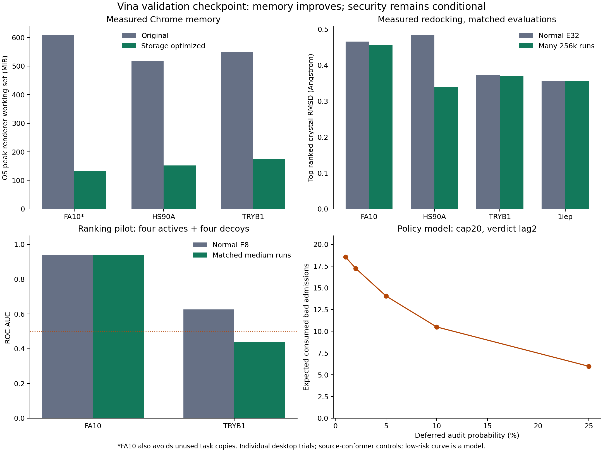

# Vina architecture validation: decision and remaining evidence

**Decision: keep the architecture. We are substantially closer to a defensible
research system, but not yet ready to claim a journal-validated useful-work
admission system.** The browser memory problem is largely an implementation
problem that we have reduced. Multi-target redocking now supports the scientific
decomposition. Multi-target ranking and the deployed low-risk security boundary
remain unresolved.

Work began on September 10 and completed September 11. The experiment directories
retain their September 10 names. The reference architecture is commit `3b564dd`;
the first resource/admission checkpoint was pushed as `670e3b2`. No campaign
scheduler, credit, seed-stream, merge/finalization or auditing redesign was made.



## 1. Stock-first scientific controls

We downloaded the official, version-pinned Vina 1.2.7 prepared **1iep/imatinib**
tutorial inputs and used its published **20 x 20 x 20 Angstrom** box. We retained
the existing DUD-E **FA10, HS90A and TRYB1** inputs, including their failures in
earlier independent-conformer and ranking experiments. These are established
sources, not synthetic scoring workloads. The official tutorial describes this
as a challenging ligand and recommends E32 for more consistent pose recovery.
[Official tutorial](https://autodock-vina.readthedocs.io/en/stable/docking_basic.html),
[DUD-E benchmark](https://dude.docking.org/).

The downloaded stock Vina binary ran E32, one CPU, nine retained/output modes,
and seeds 104729, 130363 and 155921 on each target. All **12/12** top-ranked poses
passed the predefined <=2 Angstrom symmetry-aware, unaligned heavy-atom RMSD
gate. No stock control timed out.

| Target | Stock E32 RMSD range across three seeds |
|---|---:|
| 1iep | 0.358–0.380 Angstrom |
| FA10 | 0.527–0.551 Angstrom |
| HS90A | 0.672–0.708 Angstrom |
| TRYB1 | 0.231–0.296 Angstrom |

These are **prepared/source-conformer redocking controls**. Vina still searches
positions, orientations and torsions, but the inputs retain crystallographic
internal geometry. They do not erase the earlier failures with independently
generated conformers or prove prospective screening performance.

## 2. Many medium runs versus a normal E32 job

We used exactly those prepared inputs with the unchanged original search and
finalizer. Each medium run has a 256,000-evaluation stopping budget; the count is
chosen from the actual evaluation cost of 32 normal runs. Vina checks this budget
between outer steps, so a run can overshoot it. The normal comparison uses the
same instrumented native build; the downloaded stock binary above independently
establishes that the input preparation produces strong stock redocking.

| Target | Medium runs | Normal E32 top RMSD | Medium aggregate top RMSD | Medium/normal evaluations |
|---|---:|---:|---:|---:|
| FA10, prior completed measurement | 143 | 0.466 | 0.455 | 1.0030 |
| HS90A, new | 103 | 0.484 | 0.339 | 1.0065 |
| TRYB1, new | 123 | 0.373 | 0.369 | 1.0052 |
| 1iep, new | 217 | 0.356 | 0.356 | 1.0026 |

RMSDs are Angstrom. The 1iep aggregate has the same top score as normal E32,
-13.325 kcal/mol. Three selected normal 1iep tasks, executed independently,
reproduce their monolithic raw pools and traces exactly. The other targets retain
the previously established full-task split/merge checks.

Measured search-time ratios were 1.081 for HS90A, 1.029 for TRYB1 and 1.081 for
1iep. The nearest available time-matched prefixes for HS90A and TRYB1 used 96
and 119 runs, with ratios **1.0047 and 0.9962**, and preserved the listed medium
RMSDs. Some benchmarks ran concurrently; these are descriptive comparisons, not
isolated speedup estimates. The new experiments match evaluation counts closely
and report wall time separately.

The HS90A/TRYB1 medium tests began after passing the existing stock E4 redocking
controls on the same hashed inputs; the fresh E32 repeats ran separately. The
1iep decomposition began only after its fresh stock E32 control passed. This
ordering is recorded rather than retroactively claiming all 12 controls preceded
every decomposition experiment.

**Finding:** short, independent runs can collectively preserve good pose recovery
on several targets. This is now supported beyond FA10. It is still one parent
seed per distributed aggregate, not a multi-seed noninferiority study.

## 3. Ranking is the concrete scientific blocker

First, we reanalyzed the complete earlier stock E8 panels, **eight actives plus
eight decoys per target**, and rehashed every corresponding prepared input. These
are historical measurements, not new timing trials. Their original output is
included as `historical_stock_ranking.jsonl.gz`.

| Target | Full pilot stock AUC | Uncertainty/failure |
|---|---:|---|
| FA10 | 0.844 | bootstrap 95%: 0.594–1.000 |
| HS90A | 0.219–0.344 | bounds include one timed-out active |
| TRYB1 | 0.734 | bootstrap 95%: 0.453–0.969 |

HS90A is not a validated ranking campaign. TRYB1's result is too uncertain to
call strong enrichment. We did not remove these failures or retune targets until
their scores improved.

We then ran new matched-budget medium searches on the **previously fixed
four-active/four-decoy subset**, comparing with its same-build normal E8 results.
This is an explicitly exploratory pilot, not validation of the full panels.

| Target | Normal E8 AUC | Matched medium AUC | Evaluation ratio per ligand |
|---|---:|---:|---:|
| FA10 | 0.938 | 0.938 | 1.0006–1.0143 |
| TRYB1 | 0.625 | 0.438 | 1.0014–1.0277 |

TRYB1 loses 0.1875 AUC. Its paired compound-bootstrap interval for the difference
is [-0.5, 0.0]; this small sample does not identify a general population effect,
but it plainly fails to establish preservation of ranking quality. FA10 has
identical active/decoy pair orderings in this subset, so its bootstrap difference
is zero; that is not a zero-uncertainty claim about other compounds or seeds.

**Do not infer screening equivalence from the successful redocking table.** The
missing scientific result is replicated matched-budget enrichment on a larger,
preselected multi-target panel where stock Vina itself has been validated first,
using a fixed, chemically reviewed preparation pipeline. Report independent
conformer performance separately. Add paired confidence intervals and an explicit
noninferiority margin before inspecting that larger experiment's outcomes.

## 4. Browser resources: major improvement, cold start still matters

The [resource investigation](VINA_RESOURCES_AND_ADMISSION_2026-09-10.md) measures
allocator-live bytes, allocated WASM memory, and Windows OS peak process working
set separately. The main memory consumers were dense interaction lookup tables
and their copies, not the approximately 14 MiB FA10 grid maps.

In the final FA10 storage experiment:

- Allocated WASM heap: **549.5 MiB original -> 51.2 MiB maximum observed**.
- Peak busiest-renderer working set: **608.5 MiB -> 133.1 MiB**.
- Cold setup: approximately **4.61 s -> 3.13 s** in individual measurements.
- Warm 64k calls: approximately **0.69–0.73 s** in this optimized trial.

The build moves temporary tables, shares identical XS-type tables, creates other
tables lazily, and avoids allocating unused model copies when executing one
selected task. Scoring resolution, cutoffs, arithmetic and search budgets remain
unchanged. AD4 is excluded from the type-sharing specialization. Same-runtime
tests match raw pools, traces and original receptor finalization across three
targets, including a late selected task at index127 of128. Chrome/Node checks
also match the recorded first two tasks on each tested target.

The machine was an AMD Ryzen7 7435HS with 23.7 GiB physical RAM. These measurements
make ordinary-laptop deployment plausible; they do not establish Android/iOS
compatibility, memory-pressure behavior, sustained thermals or battery cost.
Cold initialization still exceeds the desired short interaction budget. Reusing
an already initialized worker helps later runs, but is not a remedy for a fresh
visit. Smaller validated boxes and correctly initialized reusable maps remain
performance experiments, not assumed wins. No phone measurements were fabricated.

Browser Vina is established prior work, including
[Webina](https://academic.oup.com/bioinformatics/article/36/16/4513/5860016).
The port and memory engineering alone are not the journal's novelty claim.

## 5. Low-risk admission: viable only with an explicit trust boundary

Keep the proposed split:

- Established low-risk sessions can receive bounded provisional access with a
  useful run and deferred statistical replay.
- Unknown/elevated-risk sessions use multi-run bundles and the existing
  post-commit random complete-run audit before access.
- Bound global issuance, outstanding exposure and audit queues; do not silently
  skip selected audits when overloaded.

But deferred admission gives a different security property. At 5% replay, honest
client/replay computation is approximately 20:1 before other costs. In the
implemented model, a zero-work attacker with an identity cap of20 and a verdict
lag of2 admissions obtains **14.06 consumed admissions on average**. Disposable
fresh identities defeat the cap. The current outer prototype starts fresh
identities at risk zero, so it cannot be wired unchanged to a trusted-deferred
path. This investigation does not deploy that policy.

For high-risk bundles, the unchanged conditional guarantee remains
`P(pass | C correct of N) = choose(C,q)/choose(N,q)`.
One-use credits prevent duplicate consumption within the scheduler's domain.
They do not make identity creation expensive, certify fresh computation, or prove
that every unsampled result is scientifically correct.

An actual poisoning experiment replaced 32 normal TRYB1 outputs with one cheap
output. The original merger produced 15.671 Angstrom top RMSD versus 0.373 for
honest data. Complete-run replay rejected the substituted unit. A separate
single-unit forged-energy attack did not worsen that target's final top pose;
that negative result is also preserved. Deferred scientific output therefore
needs quarantine and a late-verdict lifecycle, while final-result/top-k replay
and selected replication must be evaluated for their actual repair cost. Merely
rescoring an output does not prove the requested search was performed.

## What is still needed for a defensible submission?

The architecture no longer needs another speculative pivot. It needs a joint
result demonstrating all of the following under a fixed protocol:

1. **Scientific utility:** replicated multi-target redocking and enrichment at
   matched total compute, after strong stock controls on exactly the same inputs.
   Ranking currently fails this gate; independent-conformer evidence is still weak.
2. **Admission benefit:** measured abuse/identity-churn/deferred-verdict behavior
   against simpler reputation/rate-limit and conventional-work baselines, with
   the low-risk external trust assumptions stated explicitly.
3. **Practical cost:** real laptop/phone cold and warm latency, peak memory,
   network/abandonment behavior and verifier queue cost on those validated inputs.
4. **Scientific integrity:** bounded-cost handling of late invalid outputs,
   truthful coverage accounting, and demonstrated repair without duplicate credit.

That joint experiment, plus an independent replication and a clear comparison
with prior volunteer-computing verification, is the missing contribution evidence.
The current results support continuing this architecture; they do not support a
claim of universally enforced anonymous useful work or journal acceptance yet.

## Reproduction and evidence

Raw measurements and manifests: `docs/evaluation/vina_validation_2026-09-10/`.
The primary entry points are:

```text
python scripts/validate_vina_stock_controls.py
python scripts/benchmark_vina_validated_multitarget.py
python scripts/benchmark_vina_tutorial.py
python scripts/analyze_vina_stock_ranking.py
python scripts/benchmark_vina_matched_ranking.py
python scripts/test_vina_provisional_poisoning.py
python scripts/summarize_vina_validation.py
python scripts/plot_vina_validation.py
```

These reuse the reference native build and prepared-input manifests from the
previous checkpoint. Completed expensive controls are preserved on rerun.
The stock controls, medium redocking, ranking and poisoning experiments completed.
All22 existing scheduler/admission tests passed; the core implementations remain
unchanged. The figure was rendered and visually inspected. Earlier study failures
remain visible in the journal-readiness history.
